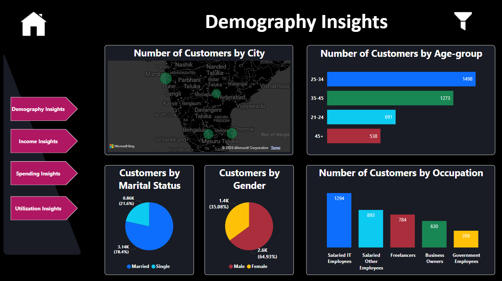
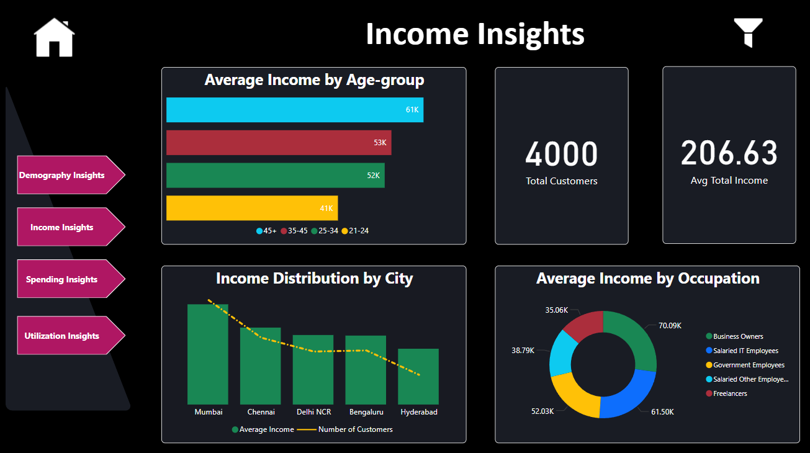
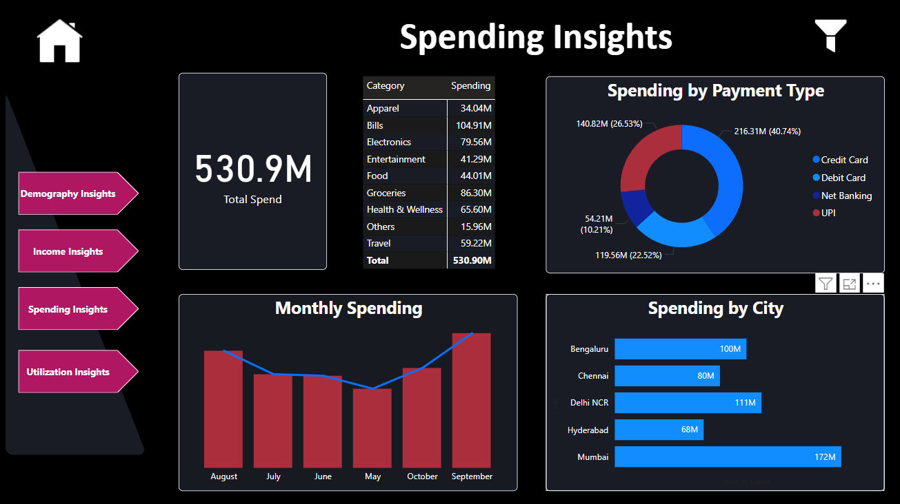
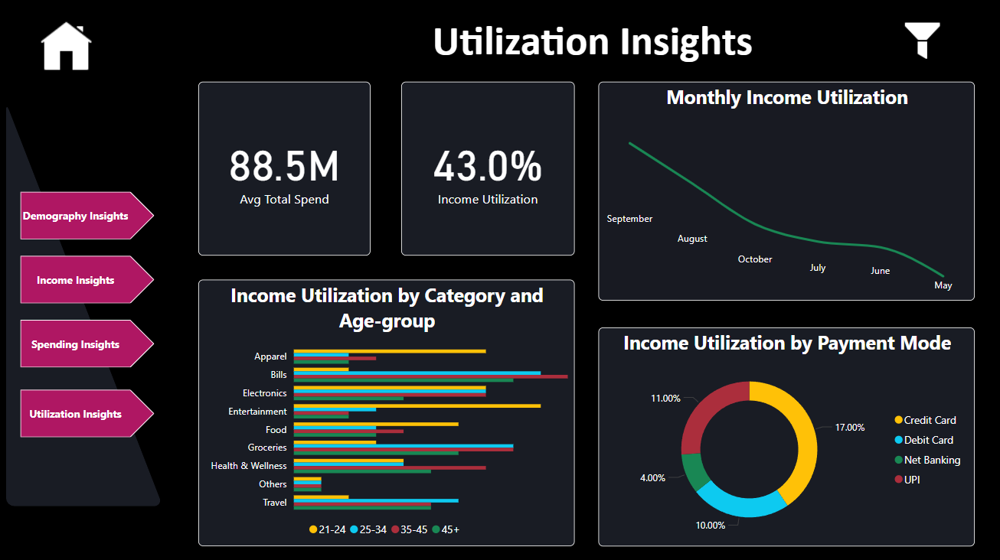
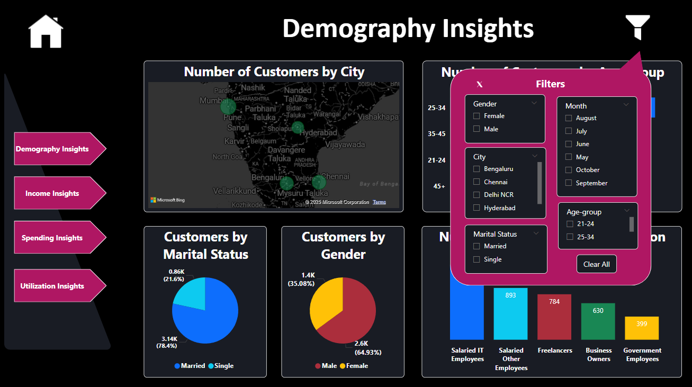

# CardMetrics: Credit Card Customer Insights

*Overview*

This repository contains the **CardMetrics** Power BI project, a data-driven dashboard developed for CardMetrics. The project aims to identify the ideal customer segments for their credit card offerings by delivering actionable insights across four key areas: Demography, Income, Spending, and Utilization.

*Pages and Features*

1. Demography Insights
Map: Customers by city.
Pie Charts: Distribution of customers by marital status and gender.
Bar Charts: Breakdown of customers by age group and occupation.

2. Income Insights
Bar Chart: Income distribution by city.
Cards: Total customers and average total income.
Ring Chart: Average income by occupation.
Bar Chart: Average income by age group.

3. Spending Insights
Card: Total spend.
Table: Spending by category.
Ring Chart: Spending by payment type.
Bar Charts: Monthly spending and spending by city.

4. Utilization Insights
Cards: Average total spend and income utilization percentage.
Line Chart: Monthly income utilization trend.
Bar Charts: Income utilization by category and age group.
Ring Chart: Income utilization by payment mode.

5. Global Filters
A filter button located at the top-right corner allows users to slice data dynamically using:
Gender
City
Marital Status
Month
Age Group

*Technologies Used*

- **Power BI Desktop**: For data modeling, visualization, and dashboard creation.
- **DAX (Data Analysis Expressions)**: Used for creating complex measures and calculated columns to drive insights.
- **Power Query (M Language)**: For data cleaning, transformation, and ETL processes.
- **Data Modeling**: Star schema implementation for optimized report performance.

*Purpose*

This report is designed to help CardMetrics:

Understand customer profiles to tailor credit card offerings.
Identify spending and income patterns for targeted marketing.
Optimize credit card utilization through data-driven strategies.